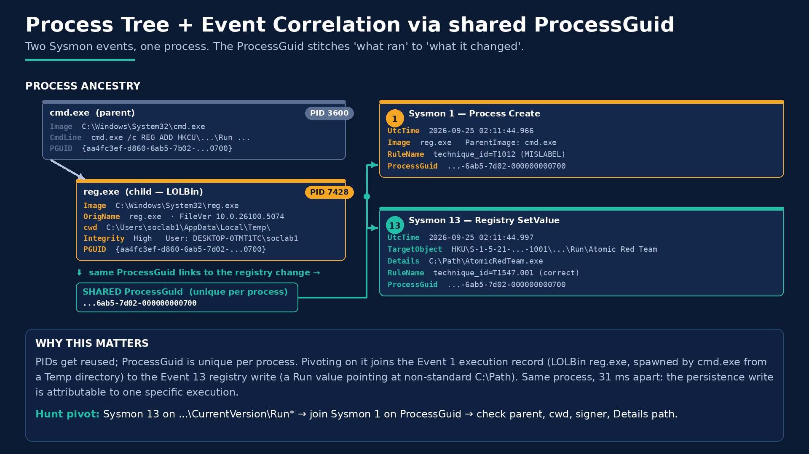
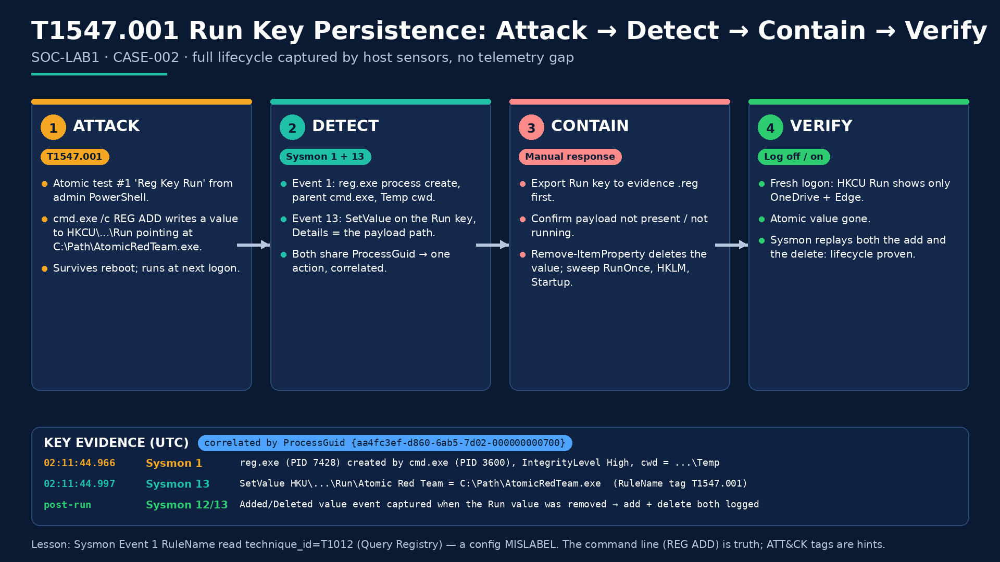

# CASE-002: Registry Run Key Persistence (T1547.001)

| Field | Value |
|-------|-------|
| **Case ID** | CASE-002 |
| **Lab** | SOC-LAB1 (VirtualBox 7.2.8 / Windows 11 Enterprise Eval, build 26100) |
| **Date** | 2026-09-25 UTC (2026-09-24 ~10:11 PM ET) |
| **Analyst** | Alexander Acevedo |
| **Severity** | Medium (controlled lab emulation) |
| **Status** | Closed: Detected, Contained, Verified |
| **MITRE ATT&CK** | [T1547.001](https://attack.mitre.org/techniques/T1547/001/): Boot or Logon Autostart Execution: Registry Run Keys / Startup Folder |
| **Emulation** | Atomic Red Team `T1547.001` Test **#1** "Reg Key Run" only |

---

## 1. Executive summary

A controlled Atomic Red Team test wrote a Registry Run key value on **SOC-LAB1** so that `C:\Path\AtomicRedTeam.exe` would launch at every logon of user `soclab1`. Sysmon recorded both the **process** that did it (Event 1: `reg.exe` spawned by `cmd.exe`) and the **registry write** itself (Event 13: SetValue on `...\CurrentVersion\Run\Atomic Red Team`). The two events share one **ProcessGuid**, 31 ms apart, which ties the persistence to one specific execution.

I then contained it by hand: exported the key as evidence, confirmed the payload was not on disk or running, deleted the value, and swept the other common autostart locations. After a log off / log on, the Run key held only the two legitimate entries, and Sysmon had logged the removal as well as the original write.

**Bottom line:** Lab 1 was *detect*. Lab 2 closes the loop: **detect, contain, verify**, with no telemetry gap across the full lifecycle.

---

## 2. Scope & safety

- Authorized testing on my own isolated VirtualBox VM. No production systems.
- **One** atomic test (`T1547.001` #1). No other techniques were run.
- The payload path `C:\Path\AtomicRedTeam.exe` is a placeholder. It did not exist on disk (verified in §9), so nothing actually ran at logon.
- I deliberately did **not** use `-Cleanup` (Atomic's cleanup is `REG DELETE ... /f`). Manual containment was the point of the lab.

---

## 3. Environment & sensor stack

| Component | Detail |
|-----------|--------|
| Host | Blair (Windows 11 Home laptop), VirtualBox 7.2.8 |
| Guest | `SOC-LAB1`, Windows 11 Enterprise Evaluation build 26100, hostname `DESKTOP-0TMT1TC`, user `soclab1` |
| Sysmon (sysmon-modular config) | Event 1 process create, Events 12/13 registry |
| PowerShell Script Block Logging | Event **4104** |
| Security auditing | Event **4688** with command line |
| Emulation | Atomic Red Team at `C:\AtomicRedTeam` (`Invoke-AtomicTest`) |
| VM clock | **UTC+2**. All times in this case are **UTC** from Sysmon `UtcTime` (see §12) |

---

## 4. Attacker context: why persistence is next

In this repo's [healthcare ransomware kill-path](../threat-context/healthcare-ransomware-kill-path.png), T1547.001 is **step 3, "Survive reboot"**:

| Step | Technique | Lab |
|------|-----------|-----|
| 1 | T1078 Valid Accounts (log in with bought creds) | Later lab |
| 2 | T1059.001 PowerShell (run commands) | [Lab 01](../01-t1059-001-powershell/CASE.md) |
| **3** | **T1547.001 Run Keys (survive reboot)** | **This case** |
| 4 | T1003.001 LSASS credential dumping | Lab 03 (next) |

Run keys are among the most common persistence methods for commodity malware and ransomware affiliates once they have a foothold. They are easy to set (no admin needed for HKCU), survive reboots, and blend in with legitimate autostarts like OneDrive and Edge. Catching and removing persistence at step 3 means a reboot or password reset actually evicts the intruder.

---

## 5. Activity performed (emulation)

Run from an **admin PowerShell** on the VM:

```powershell
$start = Get-Date
Invoke-AtomicTest T1547.001 -TestNumbers 1
```

| Atomic field | Value |
|--------------|-------|
| Test | T1547.001-1 "Reg Key Run" |
| GUID | `e55be3fd-3521-4610-9d1a-e210e42dcf05` |
| Executor | `command_prompt` |
| ElevationRequired | False |
| Result | `The operation completed successfully.` / `Exit code: 0` |

Command executed (via `cmd.exe /c`):

```text
REG ADD "HKCU\SOFTWARE\Microsoft\Windows\CurrentVersion\Run" /V "Atomic Red Team" /t REG_SZ /F /D "C:\Path\AtomicRedTeam.exe"
```

---

## 6. Timeline (UTC)

| Time (UTC) | Source | Event |
|------------|--------|-------|
| 2026-09-25 02:11 | Analyst | `Invoke-AtomicTest T1547.001 -TestNumbers 1` from admin PowerShell |
| 02:11:44.966 | Sysmon 1 | `reg.exe` (PID 7428) created by `cmd.exe` (PID 3600), IntegrityLevel High, cwd `...\AppData\Local\Temp\` |
| 02:11:44.997 | Sysmon 13 | SetValue `HKU\<SID>\...\Run\Atomic Red Team` = `C:\Path\AtomicRedTeam.exe` (same ProcessGuid, +31 ms) |
| After run | Analyst | Triage: Run key review, parent chain (§8) |
| After triage | Analyst | Containment: export, payload check, delete, sweep (§9) |
| After containment | Sysmon 12/13 | Added/Deleted value event recorded for the removal of `Atomic Red Team` |
| After containment | Analyst | Log off (`shutdown /l`), log on, re-check Run key (§10) |

Exact times of the post-run steps were not recorded. The two sensor events above are the timestamps that matter.

---

## 7. Detection evidence

### 7.1 Sysmon Event 1: Process Create

| Field | Value |
|-------|-------|
| UtcTime | `2026-09-25 02:11:44.966` |
| RuleName | `technique_id=T1012, technique_name=Query Registry` (**mislabel**, see §12) |
| ProcessGuid | `{aa4fc3ef-d860-6ab5-7d02-000000000700}` |
| ProcessId | `7428` |
| Image | `C:\Windows\System32\reg.exe` |
| FileVersion / OriginalFileName | `10.0.26100.5074` / `reg.exe` |
| CurrentDirectory | `C:\Users\soclab1\AppData\Local\Temp\` |
| User / LogonId | `DESKTOP-0TMT1TC\soclab1` / `0xB6FBE` |
| IntegrityLevel | High |
| SHA256 | `EF37663B44AC66920C6F33694DEEA01ACB78AE3F3012884819373FA04C3EB5F0` |
| ParentProcessGuid / PID | `{aa4fc3ef-d860-6ab5-7b02-000000000700}` / `3600` |
| ParentImage | `C:\Windows\System32\cmd.exe` |
| ParentCommandLine | `"cmd.exe" /c REG ADD "HKCU\SOFTWARE\Microsoft\Windows\CurrentVersion\Run" /V "Atomic Red Team" /t REG_SZ /F /D "C:\Path\AtomicRedTeam.exe"` |

### 7.2 Sysmon Event 13: Registry value set

| Field | Value |
|-------|-------|
| UtcTime | `2026-09-25 02:11:44.997` |
| RuleName | `technique_id=T1547.001` (correct) |
| EventType | SetValue |
| ProcessGuid / PID | `{aa4fc3ef-d860-6ab5-7d02-000000000700}` / `7428` (**same as Event 1**) |
| Image | `C:\Windows\system32\reg.exe` |
| TargetObject | `HKU\S-1-5-21-1723247288-1355854687-431756665-1001\Software\Microsoft\Windows\CurrentVersion\Run\Atomic Red Team` |
| Details | `C:\Path\AtomicRedTeam.exe` |
| User | `DESKTOP-0TMT1TC\soclab1` |

### 7.3 ProcessGuid correlation



- **Event 1** answers *what ran*: a LOLBin (`reg.exe`) launched by `cmd.exe` from a Temp working directory.
- **Event 13** answers *what it changed*: a Run value pointing at a non-standard path.
- **Same ProcessGuid, 31 ms apart:** one process, one action. PIDs get reused; ProcessGuid is unique per process, so it is the right join key.

Pivot I use: start at Event 13 on a Run/RunOnce key, join to Event 1 on ProcessGuid, then walk up via ParentProcessGuid.

---

## 8. Triage reasoning

The HKCU Run key held three values:

| Value | Data | Verdict |
|-------|------|---------|
| `OneDrive` | `"C:\Users\soclab1\AppData\Local\Microsoft\OneDrive\OneDrive.exe" /background` | Benign: vendor binary, standard per-user install path |
| `MicrosoftEdgeAutoLaunch_...` | `"C:\Program Files (x86)\Microsoft\Edge\Application\msedge.exe" --no-startup-window --win-session-start` | Benign: vendor binary, standard install path |
| `Atomic Red Team` | `C:\Path\AtomicRedTeam.exe` | **Malicious** |

Why the third one is the problem:

1. **Path:** `C:\Path\` is not a standard install location (not Program Files, Windows, or a known vendor AppData path).
2. **Writer:** set by `reg.exe`, a living-off-the-land binary, not by an installer or the application itself.
3. **Parent chain:** `cmd.exe /c REG ADD ...` launched from `AppData\Local\Temp\`, a typical staging location.
4. **Context:** High integrity token in a normal user session. In a real SOC I would also check for a matching change ticket.

Any one of these is a hint. Together, with the Sysmon evidence, the value is confirmed persistence. In this lab it is an authorized emulation; in production this would be a true positive to escalate.

---

## 9. Containment

All steps from an admin PowerShell. Evidence first, then removal.

| # | Action | Result |
|---|--------|--------|
| 1 | `reg export` HKCU Run to `Desktop\runkey-evidence.reg` | `The operation completed successfully.` |
| 2 | `Test-Path "C:\Path\AtomicRedTeam.exe"`; `Get-Process` filtered on that path | `False`; no process. Nothing to kill or hash |
| 3 | `Remove-ItemProperty -Path "HKCU:\Software\Microsoft\Windows\CurrentVersion\Run" -Name "Atomic Red Team"` | No error |
| 4 | Sweep HKCU RunOnce, HKLM Run, HKLM RunOnce, user Startup folder | Only HKLM Run `SecurityHealth` (`SecurityHealthSystray.exe`) and `VBoxTray` (`VBoxTray.exe`), both benign. Nothing else |

Step 4 matters: attackers often plant a backup autostart, so removing one value is not the same as removing persistence.

In a real incident, step 2 would also include killing the process tree, hashing and collecting the binary, and scoping other hosts for the same value or hash.

---

## 10. Verification

1. Logged off (`shutdown /l`) and back on, so autostarts were re-evaluated.
2. Fresh PowerShell: `Get-ItemProperty "HKCU:\Software\Microsoft\Windows\CurrentVersion\Run"` returned only **OneDrive** and **Edge**. The Atomic value was gone.
3. Sysmon query for Event IDs 12 and 13 matching `Atomic Red Team` returned the original **SetValue** plus an **added/deleted value** event for the removal:

```powershell
Get-WinEvent -FilterHashtable @{ LogName='Microsoft-Windows-Sysmon/Operational'; Id=12,13 } |
  Where-Object { $_.Message -match 'Atomic Red Team' } |
  Format-List TimeCreated, Id, Message
```

**Full lifecycle captured (write and delete), no telemetry gap.** The delete event was confirmed on the VM but not screenshotted (see §13).



---

## 11. Detection engineering (recommendations)

These are **recommendations** based on this case, not controls deployed in the lab. The Sigma rule and KQL have not been run against a SIEM yet.

### 11.1 Alert logic

- Alert on **Sysmon 13** to `...\CurrentVersion\Run` or `\RunOnce` where **Image** is `reg.exe`, `cmd.exe`, `powershell.exe`, or `pwsh.exe`, **or** where **Details** points outside Program Files / Windows.
- Maintain a **baseline allowlist** of known autostarts (here: OneDrive, Edge, SecurityHealth, VBoxTray) to keep the rule quiet.
- **Prevent**, not just detect: ASR / AppLocker / WDAC rules that block execution from user-writable paths, so a Run key pointing at one fails at logon.

### 11.2 Sigma rule

```yaml
title: Run Key Value Set by Command-Line Tool or Pointing to Non-Standard Path
id: a00ad3cc-769d-4578-bf6a-4ec5e522edda
status: experimental
description: >
  Detects a Run/RunOnce registry value written by a command-line utility, or whose
  data points outside Program Files / Windows. Based on CASE-002 (Atomic T1547.001-1).
references:
  - https://attack.mitre.org/techniques/T1547/001/
author: Alexander Acevedo
date: 2026-09-24
tags:
  - attack.persistence
  - attack.t1547.001
logsource:
  product: windows
  category: registry_set
detection:
  selection_key:
    TargetObject|contains:
      - '\Software\Microsoft\Windows\CurrentVersion\Run\'
      - '\Software\Microsoft\Windows\CurrentVersion\RunOnce\'
  selection_writer:
    Image|endswith:
      - '\reg.exe'
      - '\cmd.exe'
      - '\powershell.exe'
      - '\pwsh.exe'
  filter_std_path:
    Details|contains:
      - 'C:\Program Files\'
      - 'C:\Program Files (x86)\'
      - 'C:\Windows\'
  filter_onedrive:
    Image|endswith: '\OneDrive.exe'
    Details|contains: '\AppData\Local\Microsoft\OneDrive\OneDrive.exe'
  condition: selection_key and (selection_writer or not filter_std_path) and not filter_onedrive
falsepositives:
  - Admin or deployment scripts that set Run values with reg.exe or PowerShell
  - Per-user apps that install under AppData (add to baseline allowlist)
level: medium
```

Against this case: `Image` = `reg.exe` and `Details` = `C:\Path\AtomicRedTeam.exe`, so both branches match.

### 11.3 PowerShell hunt (local Sysmon)

```powershell
# Suspicious Run/RunOnce writes in the last 24h
$since = (Get-Date).AddDays(-1)
Get-WinEvent -FilterHashtable @{ LogName='Microsoft-Windows-Sysmon/Operational'; Id=13; StartTime=$since } |
  ForEach-Object {
    $e = @{}; ([xml]$_.ToXml()).Event.EventData.Data | ForEach-Object { $e[$_.Name] = $_.'#text' }
    [pscustomobject]$e
  } |
  Where-Object {
    $_.TargetObject -match '\\CurrentVersion\\Run(Once)?\\' -and (
      $_.Image   -match '\\(reg|cmd|powershell|pwsh)\.exe$' -or
      $_.Details -notmatch '^"?C:\\(Program Files( \(x86\))?|Windows)\\' )
  } |
  Select-Object UtcTime, Image, ProcessGuid, TargetObject, Details

# Pivot: the Event 1 record for a ProcessGuid found above
$guid = '{aa4fc3ef-d860-6ab5-7d02-000000000700}'
Get-WinEvent -FilterHashtable @{ LogName='Microsoft-Windows-Sysmon/Operational'; Id=1 } |
  Where-Object { $_.Message -match "(?m)^ProcessGuid: $([regex]::Escape($guid))" } |
  Select-Object -First 1 -ExpandProperty Message
```

### 11.4 KQL hunt (Microsoft Defender for Endpoint Advanced Hunting)

```kql
DeviceRegistryEvents
| where Timestamp > ago(7d)
| where ActionType == "RegistryValueSet"
| where RegistryKey endswith @"\CurrentVersion\Run" or RegistryKey endswith @"\CurrentVersion\RunOnce"
| where InitiatingProcessFileName in~ ("reg.exe", "cmd.exe", "powershell.exe", "pwsh.exe")
    or not(RegistryValueData has_any (@"C:\Program Files", @"C:\Windows"))
| project Timestamp, DeviceName, InitiatingProcessAccountName, InitiatingProcessFileName,
          InitiatingProcessCommandLine, InitiatingProcessParentFileName,
          RegistryKey, RegistryValueName, RegistryValueData
| order by Timestamp desc
```

---

## 12. Lessons learned

1. **ATT&CK tags are hints; the command line is the truth.** Sysmon Event 1 was tagged `technique_id=T1012 Query Registry` by the config, but the command was `REG ADD`, a write. A triage built on the tag alone would have called this discovery, not persistence. Same lesson as the Lab 1 noise-triage example, from the opposite direction.
2. **The VM clock is UTC+2, so report UTC.** `TimeCreated` in the screenshots reads 4:11 AM 9/25/2026 (VM local), while `UtcTime` is 02:11 UTC and my wall clock was ~10:11 PM ET on 9/24. Three clocks, one event. Case files use Sysmon `UtcTime` so timelines line up across hosts and tools.
3. **ProcessGuid beats PID** for joining events. It turned two log lines into one attributable action.
4. **Evidence before eradication.** Exporting the key first means the removal does not destroy the proof.
5. **Sweep, don't just delete.** Checking RunOnce, HKLM, and Startup is what turns "removed one value" into "no persistence found."
6. **Verify with a fresh logon.** Re-checking the registry in a new session is what proves containment worked.

---

## 13. Gaps & next steps

| Gap | Next step |
|-----|-----------|
| Removal (Sysmon 12/13 add/delete) event confirmed on the VM but **not screenshotted** | Capture it on the next run |
| Sysmon config mislabels `reg.exe` process creates as T1012 | Review the sysmon-modular rule; don't rely on RuleName in alerting |
| Placeholder payload never existed, so logon-time execution was not observed | A future run could use a benign binary to capture the logon launch |
| Logs reviewed locally on the endpoint; Sigma/KQL not yet run in a SIEM | Forward logs to a SIEM and validate the rule |
| Only HKCU Run tested | Other autostart locations (HKLM, Startup folder, services) in later labs |

**Next: Lab 03, T1003 credential dumping** (kill-path step 4, "Steal admin creds"): emulate, detect access to LSASS, and document hardening (LSA Protection, Credential Guard).

---

## 14. MITRE ATT&CK mapping

| Tactic | Technique | Evidence |
|--------|-----------|----------|
| Persistence / Privilege Escalation | [T1547.001](https://attack.mitre.org/techniques/T1547/001/) Registry Run Keys / Startup Folder | Sysmon 13 SetValue on HKCU Run |
| Execution | [T1059.003](https://attack.mitre.org/techniques/T1059/003/) Windows Command Shell | `cmd.exe /c REG ADD ...` parent (Sysmon 1) |
| Defense Evasion | [T1112](https://attack.mitre.org/techniques/T1112/) Modify Registry | `reg.exe` writing the value |
| *(Not observed)* | ~~T1012 Query Registry~~ | Config tag only, see §12 |

---

## 15. Artifacts checklist

- [x] Atomic test details and successful execution (exit code 0): [01-atomic-run-reg-key.png](./screenshots/01-atomic-run-reg-key.png)
- [x] Sysmon 13 SetValue and Sysmon 1 process create, same ProcessGuid: [02-sysmon13-setvalue-and-sysmon1.png](./screenshots/02-sysmon13-setvalue-and-sysmon1.png)
- [x] Parent chain (`cmd.exe` → `reg.exe`) and Run key triage showing the Atomic entry: [03-parent-chain-and-runkey-triage.png](./screenshots/03-parent-chain-and-runkey-triage.png)
- [x] Containment (export, payload check, removal) and autostart sweep: [04-containment-and-sweep.png](./screenshots/04-containment-and-sweep.png)
- [x] Post-logon verification, Run key clean: [05-post-logon-verification.png](./screenshots/05-post-logon-verification.png)
- [x] Diagram, lifecycle: [persistence-lifecycle.png](./diagrams/persistence-lifecycle.png)
- [x] Diagram, ProcessGuid correlation: [processguid-correlation.png](./diagrams/processguid-correlation.png)
- [ ] Screenshot of the Sysmon removal (add/delete) event (confirmed on VM, not captured)
- [x] Evidence export `runkey-evidence.reg` (saved to the VM desktop, not published in this repo)
- [x] This CASE.md
